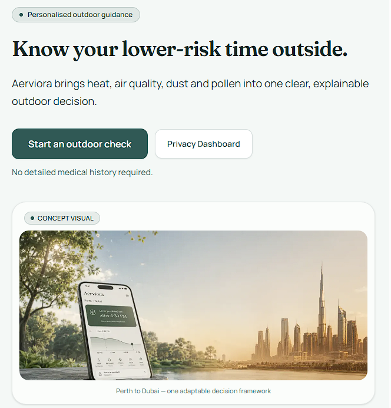
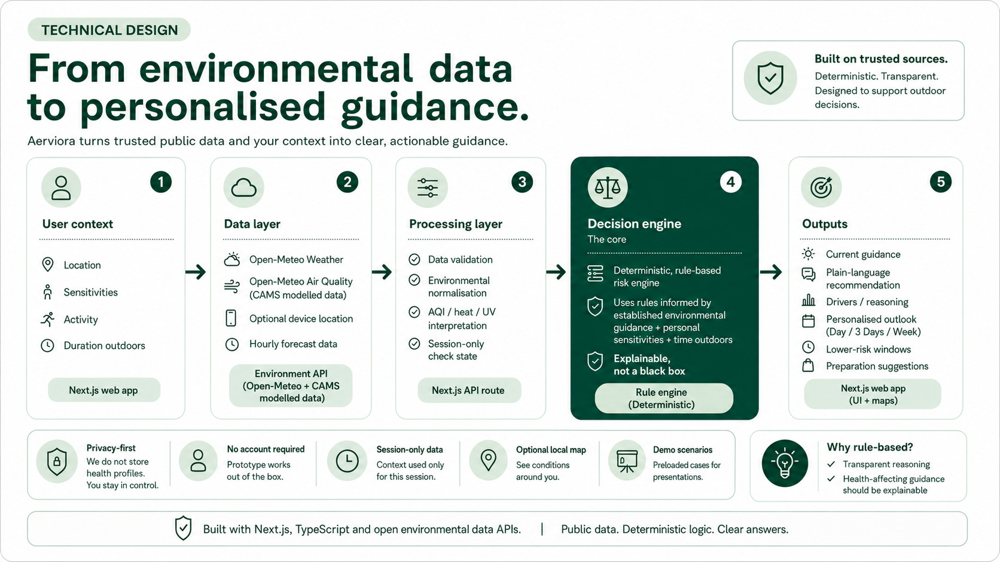
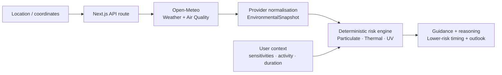

<div align="center">


# Aerviora

### Personalised environmental guidance for better outdoor decisions

**A mobile-first, privacy-focused environmental decision-support prototype built for IEEE Curtin ASPIRE 2026.**

<p>
  
  
  
  
  
</p>

<p>
  
  
  
  
  
</p>

[**Live Prototype**](https://aerviora-private.vercel.app/) ·
[**Watch Demo**](https://youtu.be/SRCkTcyiW4c) ·
[**System Architecture**](docs/architecture.md) ·
[**Final Pitch**](docs/pitch/aerviora-aspire-2026-final-pitch.pdf)

---

## Overview

Weather, heat, UV and air-quality data already exist, but people are still left to interpret multiple numbers and decide what those conditions mean for their own plans.

**Aerviora closes the gap between environmental information and everyday action.**

The prototype combines environmental conditions with user-selected context — including location, environmental sensitivities, planned activity and expected time outdoors — to produce:

- a clear environmental **concern level**
- a practical **recommended action**
- transparent **drivers and reasoning**
- contextual **preparation suggestions**
- a **lower-risk timing window** when one exists
- a personalised **Day / 3 Days / Week outlook**

Aerviora is designed as **environmental decision support**, not medical diagnosis or medical advice.

---

## Prototype Demo

<div align="center">

[](https://youtu.be/SRCkTcyiW4c)

**[▶ Watch the 2-minute prototype demo](https://youtu.be/SRCkTcyiW4c)**

</div>

The public prototype also supports live environmental data. For reliable presentations and testing, an explicit demo mode can substitute deterministic environmental scenarios while keeping the same downstream decision engine, personalisation logic and outlook system.

---

## What Aerviora Does

### 1. Understands the user's context

The user can select:

- location
- respiratory, heat and hay-fever sensitivity intensity
- planned activity
- expected outdoor duration

The prototype supports manual location search, browser geolocation and ASPIRE city shortcuts.

### 2. Reads environmental conditions

The server-side environmental data layer retrieves and normalises:

- air temperature
- apparent temperature
- relative humidity
- wind speed
- UV index
- PM2.5
- PM10
- modelled dust concentration
- particulate US AQI values

### 3. Produces explainable guidance

A deterministic TypeScript decision engine evaluates three environmental domains:

- **Particulate**
- **Thermal**
- **UV**

The engine combines those conditions with sensitivity, activity and exposure duration to derive a relative concern level and practical action.

Every result is explainable: the interface shows the environmental and contextual factors that contributed to the recommendation.

### 4. Helps users plan around conditions

The Personalised Outlook evaluates hourly forecasts and presents:

- **Day** view
- **3 Days** view
- **Week** view
- lower-risk periods where meaningful improvement exists
- time-block reasoning and preparation guidance

If required environmental inputs are unavailable, Aerviora does not invent a personalised result. It explicitly falls back to a limited, weather-only or unavailable state.

---

## Technical Architecture



Aerviora separates environmental data retrieval from personalisation and decision logic.



### Architectural principles

**Privacy-first personalisation**  
Sensitivity selections, activity and duration remain in temporary browser memory. They are not sent to Open-Meteo or stored in a user profile.

**Provider-independent domain model**  
Raw provider responses are normalised into an internal `EnvironmentalSnapshot` contract before reaching the decision engine. Alternative providers can therefore be added without rewriting downstream risk logic.

**Deterministic decision logic**  
The core recommendation path contains no generative AI. Identical inputs produce identical outputs, making the system testable, explainable and auditable.

**Live / demo parity**  
Demo mode replaces only the environmental input source. Live and simulated inputs pass through the same risk engine, outlook algorithms and presentation components.

**Graceful degradation**  
The application handles timeouts, stale data, partial provider failures and insufficient environmental inputs without fabricating recommendations.

For a detailed walkthrough of the implementation, boundaries, algorithms and source files, see **[docs/architecture.md](docs/architecture.md)**.

---

## Privacy by Design

Personalisation does **not** require a persistent health profile.

| Data | Used for the check | Sent to environmental providers | Persisted |
|---|---:|---:|---:|
| Location / coordinates | Yes | Yes | No |
| Environmental sensitivities | Yes | No | No |
| Activity | Yes | No | No |
| Outdoor duration | Yes | No | No |
| Recommendation feedback | Prototype UI only | No | No |

The current prototype has:

- no account or authentication system
- no database
- no saved location history
- no persistent health profile
- no analytics or tracking pixels
- no `localStorage` / `sessionStorage` profile persistence

User context exists only in in-memory React state for the active check.

---

## Decision Engine

The current Risk Model v2 is implemented as pure TypeScript domain logic.

At a high level:

```text
Environmental snapshot
        +
User sensitivity profile
        +
Activity & exposure duration
        ↓
Particulate assessment
Thermal assessment
UV assessment
        ↓
Cross-domain aggregation
        ↓
Concern level + action
        ↓
Drivers + preparation + lower-risk timing
```

The engine intentionally separates:

1. **technical validation** — is the provider payload structurally valid?
2. **freshness** — is the environmental sample recent enough?
3. **data readiness** — are the required signals available?
4. **risk evaluation** — what concern level follows from the validated inputs?

A technically `"ready"` result means only that enough data is available to evaluate the check. It does **not** mean environmental conditions are safe.

---

## Lower-Risk Window Search

Aerviora includes a deterministic duration-aware search over upcoming forecast hours.

For each candidate period, the algorithm:

1. constructs a window matching the user's planned outdoor duration
2. verifies consecutive usable forecast buckets
3. evaluates personalised risk across the entire window
4. conservatively assigns the window its highest risk level
5. accepts the window only when it improves by at least one full concern category
6. ranks qualifying windows by risk, peak severity and earliest start time

This avoids presenting a time as an improvement when only part of the requested activity duration has better conditions.

---

## Personalised Outlook

Hourly forecast samples are evaluated through the same decision logic and grouped into understandable time blocks.

| View | Purpose |
|---|---|
| **Day** | Detailed Today / Tomorrow timeline |
| **3 Days** | Compact comparison across three calendar days |
| **Week** | Seven-day planning overview |

Outlook availability is explicit:

- **Personalised** — required environmental inputs are available
- **Weather-only** — useful weather forecast exists but required personalisation inputs are not available that far ahead
- **Temporarily unavailable** — provider data is unavailable or stale

---

## Live Mode vs Demo Mode

| | Live Mode | Demo Mode |
|---|---|---|
| Environmental source | Open-Meteo Weather + Air Quality | Deterministic scenario fixtures |
| Geocoding | Live provider lookup / coordinates | Requested location retained |
| Risk engine | Same | Same |
| Personalisation | Same | Same |
| Outlook algorithms | Same | Same |
| Intended use | Real environmental checks | Reliable presentations and testing |

Demo mode can be activated through the prototype's demo query flow. It is visibly disclosed in the UI as simulated conditions.

---

## Technology Stack

### Application

- **Next.js 16**
- **React 19**
- **TypeScript 5**
- **Tailwind CSS 4**
- Next.js App Router
- server-side Route Handlers
- client-side React state

### Environmental data

- **Open-Meteo Geocoding API**
- **Open-Meteo Weather Forecast API**
- **Open-Meteo Air Quality API**
- **Copernicus Atmosphere Monitoring Service (CAMS)** modelled air-quality data

### Quality

- **Vitest**
- **ESLint**
- strict typed domain contracts
- mocked network calls in unit tests

### Intentionally absent from the core architecture

- no database
- no authentication
- no external Python / FastAPI backend
- no generative AI decision engine
- no persistent client profile storage

---

## Testing

The final ASPIRE prototype architecture snapshot recorded:

**375 passing unit tests across 47 test files**

Major coverage areas include:

- risk engine rules
- data readiness and validation
- timestamp freshness
- lower-risk window selection
- Day / 3-Day / Week outlook generation
- provider integration and normalisation
- API timeout and failure behaviour
- location and sensitivity flows
- recommendation feedback
- privacy and accessibility-related UI behaviour

All unit tests isolate network behaviour through mocked fetch implementations rather than calling live external services.

Run the suite locally with:

```bash
npm run test
npm run lint
npm run build
```

---

## Project Structure

```text
src/
├── app/
│   ├── api/environment/         # Environmental API route
│   ├── check/                   # Main interactive check
│   ├── privacy/                 # Privacy information
│   └── privacy-dashboard/       # Privacy dashboard
├── components/
│   ├── environment/             # Environmental metric UI
│   ├── location/                # Location components
│   ├── risk/                    # Guidance and outlook UI
│   └── demo/                    # Demo scenario controls
└── lib/
    ├── providers/open-meteo/    # Provider adapters + normalisation
    ├── risk/                    # Deterministic risk engine
    ├── preparation/             # Preparation rules
    ├── demo/                    # Simulated environmental scenarios
    └── location/                # Browser location utilities

docs/
├── architecture.md
├── media/
│   ├── demo-thumbnail.png
│   └── technical-architecture.png
└── pitch/
    └── aerviora-aspire-2026-final-pitch.pdf
```

---

## Run Locally

### Requirements

- Node.js
- npm

### Setup

```bash
git clone git@github.com:Dae-Y/aerviora.git
cd aerviora
npm ci
npm run dev
```

Then open:

```text
http://localhost:3000
```

Run the quality checks with:

```bash
npm run test
npm run lint
npm run build
```

---

## Data Sources & Attribution

Aerviora currently uses public environmental data services from:

- **Open-Meteo** — geocoding and weather forecast data
- **Open-Meteo Air Quality** — air-quality forecast interface
- **Copernicus Atmosphere Monitoring Service (CAMS)** — modelled atmospheric data used by the air-quality provider

Provider-specific responses are converted into Aerviora's internal environmental domain model before being used by the decision engine.

---

## Current Prototype Limitations

This repository represents a working competition prototype, not a clinically validated health product.

Current limitations include:

- air-quality and dust values are modelled regional estimates rather than hyper-local street sensor measurements
- live pollen data is **not currently available** in the four-city provider setup
- environmental decision thresholds have not undergone formal clinical validation
- user context is intentionally session-only and resets when the page is refreshed
- recommendation feedback is UI-only and is not currently stored or used for learning

Future work could include additional environmental providers, hyper-local sensor integration, validated pollen data, optional profile persistence with explicit consent, and expert-reviewed decision rules.

---

## Sustainability & Impact

Aerviora was designed around three UN Sustainable Development Goals:

- **SDG 3 — Good Health and Well-being**  
  Support preventive environmental decision-making and practical preparation.

- **SDG 9 — Industry, Innovation and Infrastructure**  
  Turn existing environmental monitoring infrastructure into an accessible digital decision-support layer.

- **SDG 11 — Sustainable Cities and Communities**  
  Help residents adapt everyday activities to changing environmental conditions and support healthier, more resilient urban life.

---

## IEEE Curtin ASPIRE 2026

Aerviora was developed by **Team D** for **IEEE Curtin ASPIRE 2026**, a two-week international innovation and sustainability sprint involving students across Curtin University's Bentley, Dubai, Colombo and Malaysia campuses.

The project progressed from problem research and business-model development to a working technical prototype, live deployment, demonstration and final pitch.

### Project artefacts

- **[Prototype Demo](https://youtu.be/SRCkTcyiW4c)**
- **[Technical Architecture](docs/architecture.md)**
- **[Final Pitch Deck](docs/pitch/aerviora-aspire-2026-final-pitch.pdf)**

---

## Disclaimer

Aerviora is a prototype environmental decision-support system developed for an innovation competition.

It is **not a medical device, diagnostic system or substitute for professional medical advice**. Recommendations are intended to help users interpret environmental conditions and plan activities with greater awareness. Users remain responsible for their own decisions and should follow official emergency warnings and advice from qualified health professionals where appropriate.

---

<div align="center">

### Aerviora

**Environmental data in. Transparent, personalised guidance out.**

[Live Prototype](https://aerviora-private.vercel.app/) ·
[Demo](https://youtu.be/SRCkTcyiW4c) ·
[Architecture](docs/architecture.md) ·
[Pitch Deck](docs/pitch/aerviora-aspire-2026-final-pitch.pdf)

</div>
