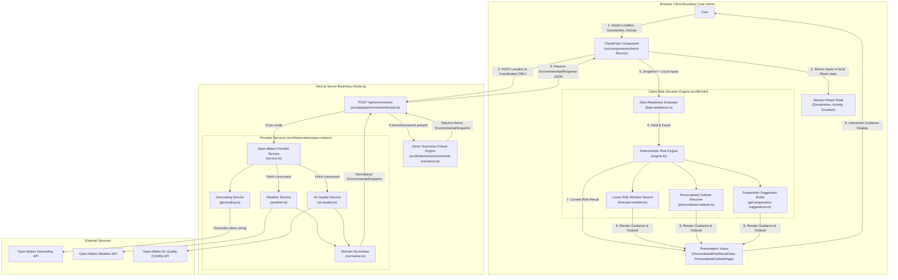

# Aerviora System Architecture

- Status: Current implemented prototype
- Architecture snapshot date: 9 August 2026
- Framework: Next.js 16.2.12 (React 19.2.4)
- Language: TypeScript 5
- Purpose: Technical reference for the current ASPIRE 2026 prototype

---

## 1. System Overview

Aerviora is a mobile-first, privacy-focused environmental health decision-support web application designed to help users evaluate outdoor activity conditions and select lower-risk timing windows. The application combines weather metrics (temperature, apparent temperature, relative humidity, wind speed), UV exposure index, and atmospheric pollutant measurements (PM2.5, PM10, modelled dust concentration) with user-selected sensitivity categories and activity profiles to provide transparent, explainable recommendations.

The system accepts three main categories of input: location input (manual city search, browser geolocation coordinates, or prototype city shortcuts), user sensitivity intensity profiles (respiratory, heat, and hay-fever sensitivities with four intensity tiers), and planned activity parameters (activity exertion category and expected duration in minutes). In response, Aerviora produces a deterministic risk evaluation, guidance action, explainable risk drivers, contextual preparation suggestions, a lower-risk timing window recommendation, and a multi-day personalised outlook across daily and weekly calendar layouts.

Aerviora is structured into four distinct architectural layers:
1. **Environmental Data Layer**: A server-side API Route Handler ([`src/app/api/environment/route.ts`](../src/app/api/environment/route.ts)) that fetches, parses, and normalises live weather and air-quality data into a unified, provider-independent snapshot contract.
2. **Personal Context Layer**: Client-side browser session state that captures optional user sensitivities, planned activity, and duration without storing personal profiles or transmitting context to external servers.
3. **Deterministic Decision Layer**: A pure, testable TypeScript engine ([`src/lib/risk/engine.ts`](../src/lib/risk/engine.ts)) that evaluates multi-domain environmental risk (Particulate, Thermal, UV), applies context modifiers, aggregates cross-domain severity, and derives structured explanations without using generative AI or probabilistic health models.
4. **Presentation Layer**: Mobile-first React client components ([`src/components/check-flow.tsx`](../src/components/check-flow.tsx)) delivering an interactive check flow, accessible metric tiles, lower-risk window cards, and responsive multi-day outlook calendar views.

The application operates in two distinct operational modes: **Live Mode** (querying Open-Meteo Weather and Air Quality APIs) and **Demo Mode** (invoked via `?demo=1` or demo scenario controls, loading deterministic environmental scenario fixtures). Both operational modes pass through the exact same downstream client-side decision engine and presentation views.

---

## 2. Architecture at a Glance

The following flowchart illustrates the high-level system architecture, client/server execution boundaries, and data flow of the current Aerviora codebase:



---

## 3. Technology Stack

Aerviora is built using the following direct dependencies and technologies:

### Framework & Core Architecture
- **Next.js 16.2.12**: App Router architecture for server-side route handling, page routing, and asset optimization.
- **React 19.2.4 & React-DOM 19.2.4**: UI component rendering and hooks-based state management.
- **TypeScript 5**: Strict static type system for domain models, provider contracts, and decision rules.

### Styling & Typography
- **Tailwind CSS v4 (`tailwindcss` & `@tailwindcss/postcss`)**: Modern utility-first CSS framework with custom environmental design system tokens.
- **Self-Hosted Local Fonts (`next/font/local`)**: Manrope Variable (product/interface typography) and Fraunces Variable (display/brand headings) hosted locally under [`src/app/fonts/`](../src/app/fonts/). No external browser requests are made to Google Fonts or third-party CDNs.

### Testing & Code Quality
- **Vitest 4.1.10**: Fast unit test runner configured for Node environment testing in [`vitest.config.mts`](../vitest.config.mts).
- **ESLint 9 (`eslint-config-next`)**: Static code analysis and linting.

### External APIs
- **Open-Meteo Geocoding API**: Resolves location query strings into geographic coordinates, timezones, and administrative metadata.
- **Open-Meteo Weather Forecast API**: Retrieves temperature, apparent temperature, relative humidity, wind speed, and UV index.
- **Open-Meteo Air Quality API (CAMS)**: Retrieves PM2.5, PM10, modelled dust concentrations, and US AQI indices from Copernicus Atmosphere Monitoring Service data.

### Intentionally Absent Technologies
- **No Database**: No PostgreSQL, MongoDB, Prisma, or ORM.
- **No Authentication**: No user accounts, passwords, OAuth, or session tokens.
- **No Client Storage Persistence**: No `localStorage` or `sessionStorage` usage for user profiles or location histories.
- **No External Backend**: No Python, FastAPI, Node Express, or microservices server.
- **No Generative AI**: No LLM, OpenAI API, LangChain, or probabilistic health engines in the decision path.

---

## 4. Repository Structure

The repository source code is structured as follows:

```
src/
├── app/                                    # Next.js App Router pages and API routes
│   ├── api/
│   │   └── environment/
│   │       └── route.ts                    # POST server Route Handler for environmental data retrieval
│   ├── check/
│   │   └── page.tsx                        # Client interactive outdoor check page shell
│   ├── privacy/
│   │   └── page.tsx                        # Detailed privacy information page
│   ├── privacy-dashboard/
│   │   └── page.tsx                        # Interactive Privacy Dashboard page
│   ├── dev/
│   │   └── illustrations/                  # Internal developer preview page for visual assets
│   ├── fonts.ts                            # Local font configuration (Manrope & Fraunces)
│   ├── globals.css                         # Global CSS styles and Tailwind imports
│   └── layout.tsx                          # Root application layout shell with AppHeader and AppFooter
├── components/                             # React presentation and flow components
│   ├── check-flow.tsx                      # Primary state machine for the 3-step check flow
│   ├── check-progress.tsx                  # Progress indicator bar for check steps
│   ├── custom-duration-dialog.tsx          # Accessible native <dialog> for custom duration selection
│   ├── environment-snapshot.tsx            # Current environmental metrics grid and snapshot display
│   ├── app-header.tsx                      # Main site navigation header
│   ├── app-footer.tsx                      # Site footer component
│   ├── privacy-dashboard.tsx               # Privacy dashboard component
│   ├── demo/
│   │   └── demo-scenario-controls.tsx      # Demo mode scenario switcher toolbar
│   ├── environment/
│   │   ├── air-quality-recovery-panel.tsx  # Air quality retry/recovery banner component
│   │   ├── metric-definitions.ts           # Technical definitions and explanations for environmental metrics
│   │   ├── metric-detail-dialog.tsx        # Modal dialog explaining metric significance
│   │   └── metric-tile.tsx                 # Interactive environmental metric tile component
│   ├── location/
│   │   ├── local-context-card.tsx          # Card displaying resolved location details
│   │   ├── local-context-map.tsx           # Map visual component for location confirmation
│   │   ├── selected-location-card.tsx      # Selected location badge component
│   │   └── use-current-location-button.tsx # Browser geolocation button component
│   └── risk/
│       ├── compact-conditions-summary.tsx  # Compact summary of active environmental drivers
│       ├── hourly-guidance-strip.tsx       # Hourly forecast risk strip visualization
│       ├── lower-risk-window-card.tsx      # Card displaying identified lower-risk timing window
│       ├── outlook-block-details.tsx       # Detail view for selected outlook time block
│       ├── outlook-calendar-layout.ts      # Multi-day grid formatting utilities
│       ├── outlook-date-navigator.tsx      # Date navigation controls for multi-day outlook
│       ├── outlook-day-summary-card.tsx    # Daily summary card in multi-day outlook
│       ├── outlook-day-tabs.tsx            # Day tab switcher component
│       ├── outlook-three-day-view.tsx      # 3-day calendar view component
│       ├── outlook-timeline.tsx            # Hourly timeline component
│       ├── outlook-view-mode-switcher.tsx  # Switcher for Day / 3-Day / Week outlook modes
│       ├── outlook-week-view.tsx           # 7-day calendar view component
│       ├── personalised-outlook-page.tsx   # Main multi-day Personalised Outlook page view
│       ├── personalised-risk-result.tsx    # Personalised current risk evaluation result view
│       ├── preparation-suggestions.tsx     # Contextual preparation suggestions grid
│       └── recommendation-feedback.tsx     # Prototype recommendation feedback UI control
└── lib/                                    # Domain logic, engines, and provider integrations
    ├── check-options.ts                    # Input options, sensitivity profiles, and location shortcuts
    ├── duration.ts                         # Duration presets and custom duration parsing helpers
    ├── environment-api.ts                  # API contract interfaces and validation functions
    ├── environment-format.ts               # Unit formatting and display string builders
    ├── demo/
    │   └── environmental-scenarios.ts      # Deterministic demo scenario environmental fixtures
    ├── location/
    │   ├── browser-geolocation.ts          # Browser navigator.geolocation wrapper
    │   ├── location-label.ts               # Location string formatting utilities
    │   └── types.ts                        # Geolocation type definitions
    ├── preparation/
    │   ├── get-preparation-suggestions.ts  # Rules engine for contextual preparation items
    │   ├── rules.ts                        # Thresholds and item priority constants for preparation items
    │   └── types.ts                        # Preparation item interface definitions
    ├── providers/
    │   └── open-meteo/                     # Open-Meteo environmental data provider package
    │       ├── air-quality.ts              # Open-Meteo Air Quality API fetcher
    │       ├── constants.ts                # Default timeouts and API endpoint URL constants
    │       ├── geocoding.ts                # Open-Meteo Geocoding API fetcher
    │       ├── index.ts                    # Provider entry point exports
    │       ├── normalise.ts                # Merges raw provider JSON into EnvironmentalSnapshot
    │       ├── service.ts                  # Main provider service coordinator
    │       └── weather.ts                  # Open-Meteo Weather API fetcher
    └── risk/                               # Deterministic risk engine package
        ├── copy.ts                         # Action titles, explanations, and risk driver copy rules
        ├── data-readiness.ts               # Technical data readiness evaluation logic
        ├── engine.ts                       # Core Risk Model v2 evaluation engine
        ├── forecast-window.ts              # Lower-risk window search algorithm over forecast
        ├── freshness.ts                    # ISO timestamp freshness calculation logic
        ├── multi-day-outlook.ts            # Multi-day outlook aggregation engine (Day/3-Day/Week)
        ├── outlook-availability.ts         # Outlook availability state resolver (personalised/weather-only)
        ├── outlook-comparison.ts           # Hourly comparison profile builder and trend comparator
        ├── outlook-display-segments.ts     # Segment formatting for outlook timeline
        ├── outlook-time-blocks.ts          # Hourly bucket grouping into time blocks
        ├── personalised-outlook.ts         # Today/Tomorrow personalised outlook resolver
        ├── signals.ts                      # Signal relevance selector based on user check input
        ├── types.ts                        # Core risk domain type contracts and interfaces
        └── validation.ts                   # Environmental sample technical integrity validator
```

---

## 5. Application Flow

The core user experience is delivered through the interactive outdoor check flow located at `/check` ([`src/components/check-flow.tsx`](../src/components/check-flow.tsx)). The flow is managed by an explicit state machine with the following sequence:

```
[Screen: location] ──> [Screen: sensitivities] ──> [Screen: activity] ──> [Screen: review]
                                                                                │
                                                                         (Confirm setup)
                                                                                │
                                                                                ▼
[Screen: environment-success] <── (Response OK) ── [Screen: environment-loading]
          │
          ├──> View Current Risk Guidance (PersonalisedRiskResultView)
          │         └──> View Lower-Risk Window (LowerRiskWindowCard)
          │
          └──> View Personalised Outlook (PersonalisedOutlookPage)
                    ├── Day View (Today / Tomorrow)
                    ├── 3-Day View
                    └── Week View (7 Days)
```

### Detailed Screen Progression

1. **Step 1: Location (`FlowScreen: "location"`)**:
   - The user specifies a location using one of three methods:
     - Typing a location string (e.g., `"Perth, Australia"`).
     - Clicking the `"Use my current location"` button, triggering the browser's `navigator.geolocation` API ([`src/lib/location/browser-geolocation.ts`](../src/lib/location/browser-geolocation.ts)).
     - Selecting one of four ASPIRE campus-city prototype shortcuts (`Perth`, `Miri`, `Colombo`, `Dubai`).
2. **Step 2: Sensitivities (`FlowScreen: "sensitivities"`)**:
   - The user specifies their sensitivity intensity tier for three environmental categories:
     - **Respiratory sensitivity**: `not-affected` | `slight` | `moderate` | `strong`
     - **Heat sensitivity**: `not-affected` | `slight` | `moderate` | `strong`
     - **Hay-fever sensitivity**: `not-affected` | `slight` | `moderate` | `strong`
   - All categories default to `"not-affected"`.
3. **Step 3: Activity and Duration (`FlowScreen: "activity"`)**:
   - The user selects a planned outdoor activity category:
     - `light-walking` (Light activity)
     - `moderate-activity` (Moderate effort)
     - `exercise` (High exertion)
     - `outdoor-work` (High exertion)
   - The user selects an expected duration in minutes using preset buttons (`15m`, `30m`, `45m`, `60m`, `90m`, `120m`) or opens the custom duration native `<dialog>` modal ([`src/components/custom-duration-dialog.tsx`](../src/components/custom-duration-dialog.tsx)) for custom inputs (1 to 240 minutes).
4. **Step 4: Review (`FlowScreen: "review"`)**:
   - Displays a consolidated summary card of location, sensitivities, activity, and duration.
   - Allows inline editing of any section without losing other configured options.
5. **Step 5: Environmental Retrieval (`FlowScreen: "environment-loading"`)**:
   - Dispatches a server request to `POST /api/environment`.
   - Displays an accessible loading spinner with a cancel option returning to the review screen.
6. **Step 6: Guidance & Personalised Outlook (`FlowScreen: "environment-success"`)**:
   - Upon receiving the environmental snapshot, client-side code evaluates data readiness and calculates personalized risk guidance ([`src/components/risk/personalised-risk-result.tsx`](../src/components/risk/personalised-risk-result.tsx)).
   - Provides a toggle between **Current Risk Guidance** and **Personalised Outlook** ([`src/components/risk/personalised-outlook-page.tsx`](../src/components/risk/personalised-outlook-page.tsx)).

### State Lifecycle and Reset
All check choices are stored in React component state (`useState` in `CheckFlow`). When the user clicks `"Start another check"`, edits a setup field, or refreshes the page, the state is re-initialized. No state is persisted to disk, local storage, or server databases.

---

## 6. Client and Server Boundaries

Aerviora strictly enforces client/server operational boundaries to protect user privacy and maximize technical determinism.

### Server Components & Route Handlers
- **Server Route Handler (`POST /api/environment`)**: Executed on the Next.js server runtime. Receives location queries, coordinates, and force-refresh flags; performs external HTTP requests to Open-Meteo APIs; normalises raw JSON into `EnvironmentalSnapshot` objects; and returns cached/fresh responses.
- **Server Page Shells**: Root layout ([`src/app/layout.tsx`](../src/app/layout.tsx)) and static page entries (`/`, `/check`, `/privacy`, `/privacy-dashboard`).

### Client Components (`"use client"`)
- **`CheckFlow`**: Manages step-by-step UI state, form inputs, geocoding trigger, loading spinners, and error screens.
- **`PersonalisedRiskResultView` & `PersonalisedOutlookPage`**: Render current guidance, drivers, preparation suggestions, lower-risk window cards, and multi-day calendar views.
- **Decision Engine Modules (`src/lib/risk/`)**: Executed exclusively in the browser client.

### Privacy Boundary Verification
The following table details exactly what data leaves the client browser versus what remains strictly local:

| Information Item | Sent to `/api/environment`? | Sent to External Providers (Open-Meteo)? | Stored in Browser / Session State |
| :--- | :--- | :--- | :--- |
| **Location Query String** | Yes (e.g. `"Perth, Australia"`) | Yes (Geocoding API only) | In-memory React state |
| **Device Lat/Long Coordinates** | Yes (if geolocation approved) | Yes (Weather & Air Quality APIs) | In-memory React state |
| **Prototype Location ID** | Yes (if shortcut clicked) | No | In-memory React state |
| **Demo Scenario ID** | Yes (if `?demo=1` active) | No (Bypasses external APIs) | In-memory React state |
| **Respiratory Sensitivity** | **NO** | **NO** | In-memory React state |
| **Heat Sensitivity** | **NO** | **NO** | In-memory React state |
| **Hay-Fever Sensitivity** | **NO** | **NO** | In-memory React state |
| **Planned Activity** | **NO** | **NO** | In-memory React state |
| **Duration Minutes** | **NO** | **NO** | In-memory React state |

**Critical Architectural Guarantee**: Personal context (sensitivities, planned activity, and duration) **never leaves the browser**. The server Route Handler has zero knowledge of the user's health sensitivities or planned activities.

---

## 7. Environmental Data Pipeline

The environmental data pipeline fetches, processes, and normalises live environmental data from external API providers.

```
Location Input (City / Coordinates)
  │
  ├──> Open-Meteo Geocoding API ──> Resolved Lat/Long & Timezone
  │
  ├──> Open-Meteo Weather API ─────> Air Temp, Apparent Temp, RH, Wind Speed, UV Index
  │
  └──> Open-Meteo Air Quality API ──> PM2.5, PM10, Dust Concentration, US AQI Indices (CAMS)
        │
        ▼
  Domain Normalisation (combineCurrentSamples & combineHourlySamples)
        │
        ▼
  Unified EnvironmentalSnapshot
```

### Data Pipeline Details
1. **Geocoding & Location Resolution**:
   - Implemented in [`src/lib/providers/open-meteo/geocoding.ts`](../src/lib/providers/open-meteo/geocoding.ts).
   - If manual location text is entered, the server queries `https://geocoding-api.open-meteo.com/v1/search`.
   - If browser geolocation is used, coordinates (`latitude`, `longitude`) are used directly, and geocoding is invoked only to retrieve human-readable administrative labels and location timezone.
2. **Concurrent Provider Requests**:
   - Implemented in [`src/lib/providers/open-meteo/service.ts`](../src/lib/providers/open-meteo/service.ts).
   - Uses `Promise.allSettled` with independent `AbortController` timeouts (default 8,000 ms) to fetch Weather and Air Quality data concurrently.
   - Weather endpoint (`https://api.open-meteo.com/v1/forecast`): Requests hourly and current `temperature_2m`, `apparent_temperature`, `relative_humidity_2m`, `wind_speed_10m`, and `uv_index`.
   - Air Quality endpoint (`https://air-quality-api.open-meteo.com/v1/air-quality`): Requests hourly and current `pm2_5`, `pm10`, `dust`, `us_aqi_pm2_5`, and `us_aqi_pm10` derived from Copernicus Atmosphere Monitoring Service (CAMS) atmospheric models.
3. **Data Characteristics & Disclosures**:
   - **Modelled Dust Data**: Presented as numeric dust concentration (`dustUgM3`). The UI explicitly discloses that dust values are modelled regional concentrations and do not constitute an official dust-storm alert.
   - **Pollen Data Availability**: Pollen levels (`pollenLevel`) are defined in internal domain contracts but are **not available** in the current live Open-Meteo four-city provider setup. Pollen fields remain `undefined` in live snapshots.
   - **Cache Control**: API Route Handler responses set `Cache-Control: no-store` to ensure browsers do not cache stale environmental data.

---

## 8. Provider Independence

Aerviora decouples external provider data formats from the internal decision engine using a provider-independent domain contract defined in [`src/lib/risk/types.ts`](../src/lib/risk/types.ts).

### Provider Boundary Architecture
```
External Open-Meteo JSON
  │
  ▼
[src/lib/providers/open-meteo/normalise.ts]
  │ (Normalises raw API arrays into standard TypeScript structures)
  ▼
EnvironmentalSnapshot (Provider-Independent Domain Object)
  │
  ▼
[src/lib/risk/engine.ts] (Pure decision logic, zero Open-Meteo references)
```

The normalisation module ([`src/lib/providers/open-meteo/normalise.ts`](../src/lib/providers/open-meteo/normalise.ts)) converts provider-specific structures into the standard `EnvironmentalSnapshot` contract. This isolation allows alternative weather or air-quality data providers (e.g., Tomorrow.io, ECMWF, local IoT sensor networks) to be integrated in the future by creating a new provider adapter without modifying any downstream risk engine rules, UI components, or test suites.

---

## 9. Environmental Domain Model

The core internal environmental data model represents environmental snapshots, samples, signal keys, and source provenance.

### Main Data Structures

#### 1. Environmental Snapshot (`EnvironmentalSnapshot`)
The top-level container for a location check:
- `requestedLocation`: Original search string or coordinate label.
- `resolvedLocation`: Formatted display name (e.g., `"Perth, Western Australia"`).
- `current`: `CurrentEnvironmentalSample` (latest observation).
- `hourly`: `ForecastEnvironmentalSample[]` (array of hourly forecast buckets).
- `sources`: `EnvironmentalSource[]` (provenance and status of provider sources).

#### 2. Current & Forecast Environmental Samples
Represent atmospheric conditions at a specific timestamp:

| Property | Type | Unit / Range | Description |
| :--- | :--- | :--- | :--- |
| `observedAt` / `validAt` | `string` | ISO-8601 UTC string | Time of measurement or forecast validity |
| `airTemperatureC` | `number \| undefined` | °C (-100 to +100) | Ambient air temperature |
| `apparentTemperatureC` | `number \| undefined` | °C (-100 to +100) | Heat index / feels-like temperature |
| `relativeHumidityPercent` | `number \| undefined` | % (0 to 100) | Relative humidity |
| `windSpeedKph` | `number \| undefined` | km/h (0 to 1000) | Wind speed at 10m height |
| `uvIndex` | `number \| undefined` | Index (0 to 100) | Ultraviolet radiation index |
| `pm25UgM3` | `number \| undefined` | µg/m³ (0 to 10000) | Fine particulate matter (<2.5 µm) |
| `pm10UgM3` | `number \| undefined` | µg/m³ (0 to 10000) | Coarse particulate matter (<10 µm) |
| `dustUgM3` | `number \| undefined` | µg/m³ (0 to ∞) | Modelled dust concentration |
| `pm25UsAqi` | `number \| undefined` | US AQI Index | Calculated US AQI for PM2.5 |
| `pm10UsAqi` | `number \| undefined` | US AQI Index | Calculated US AQI for PM10 |
| `pollenLevel` | `EnvironmentalLevel` | Ordinal level | Pollen concentration tier (`none` to `very-high`) |
| `dustLevel` | `EnvironmentalLevel` | Ordinal level | Dust level tier (`none` to `very-high`) |

#### 3. Signal Representation & Missing Values
- **Missing vs. Zero**: A value of `0` represents a valid measurement of zero (e.g., UV index 0 at night or 0 µg/m³ PM2.5). Missing provider data is strictly represented as `undefined`.
- **Raw Dust vs. Classified Dust**: Both raw numeric concentration (`dustUgM3`) and ordinal classification (`dustLevel`) are supported in the domain model.

---

## 10. Validation, Freshness and Data Readiness

Aerviora maintains a strict separation between technical data integrity, timestamp freshness, and user-specific data readiness.

### 1. Technical Validation ([`src/lib/risk/validation.ts`](../src/lib/risk/validation.ts))
Technical validation verifies that incoming numerical values fall within physically plausible bounds to prevent corrupted provider payloads from entering the decision engine.

- **Timestamp Checks**: Must be non-empty ISO-8601 strings containing timezone offsets (`Z` or `+HH:MM`/`-HH:MM`).
- **Numeric Bounds**:
  - Temperature & Apparent Temperature: -100°C to +100°C
  - Relative Humidity: 0% to 100%
  - Wind Speed: 0 to 1000 km/h
  - UV Index: 0 to 100
  - PM2.5 & PM10: 0 to 10,000 µg/m³
- Issues are categorized by severity (`error` vs `warning`).

### 2. Timestamp Freshness ([`src/lib/risk/freshness.ts`](../src/lib/risk/freshness.ts))
Evaluates the timeliness of observations relative to a reference time using the prototype policy (`PROTOTYPE_DATA_FRESHNESS_POLICY`):
- `maximumCurrentAgeMinutes`: **180 minutes (3 hours)**
- `maximumForecastAgeMinutes`: **360 minutes (6 hours)**
- `futureToleranceMinutes`: **15 minutes** (clock skew tolerance)
- Freshness Statuses: `"fresh"` | `"stale"` | `"future"` | `"invalid"`

### 3. Data Readiness ([`src/lib/risk/data-readiness.ts`](../src/lib/risk/data-readiness.ts))
Data readiness determines whether sufficient valid signals are available to compute a risk evaluation for a specific user check setup.

- **Relevant Signals (`getRelevantSignals`)**: Dynamically constructed based on user inputs. Core signals (`apparentTemperatureC`, `relativeHumidityPercent`, `pm25UgM3`, `pm10UgM3`) are always relevant. Sensitivities add contextual signals (e.g., respiratory sensitivity adds `dustUgM3`; heat sensitivity adds `apparentTemperatureC` and `relativeHumidityPercent`).
- **Readiness Statuses**:
  - `"ready"`: All relevant core and contextual signals are present, valid, and fresh.
  - `"partial"`: Usable core signals are available, but non-critical contextual signals or sources are missing or stale. Confidence is set to `"moderate"`.
  - `"insufficient"`: Missing current sample, stale/future timestamp, or zero usable core signals. The engine returns risk level `"unable"`.

**Critical Architectural Invariant**: Status `"ready"` signifies ONLY technical data completeness for risk evaluation. It **never** implies safe environmental conditions.

---

## 11. Deterministic Decision Engine

The Risk Model v2 decision engine ([`src/lib/risk/engine.ts`](../src/lib/risk/engine.ts)) evaluates personalized environmental risk using transparent, testable rules.

```
Input Normalisation & Exposure Demand Resolution
  │
  ├──> Particulate Domain Assessment (assessParticulateDomain)
  ├──> Thermal Domain Assessment     (assessThermalDomain)
  └──> UV Domain Assessment          (assessUvDomain)
        │
        ▼
  Cross-Domain Aggregation (aggregateCrossDomainRisk)
        │
        ▼
  Personalised Risk Result (Level + Action + Drivers + Limitations)
```

### Step 1: Input Normalisation & Exposure Demand
- **Sensitivity Profile**: Normalises inputs into a `SensitivityProfile` object (`respiratory`, `heat`, `hayFever`).
- **Exposure Demand (`resolveExposureDemand`)**: Combines physical exertion (`light-walking`, `moderate-activity`, `exercise`, `outdoor-work`) and duration into an exposure demand category (`low`, `moderate`, `high`):
  - High exertion + duration ≥ 60 mins -> `"high"`
  - Any activity + duration ≥ 120 mins -> `"high"`
  - High exertion + duration < 60 mins -> `"moderate"`
  - Any activity + duration 60–119 mins -> `"moderate"`
  - Otherwise -> `"low"`

### Step 2: Multi-Domain Environmental Assessments

#### 1. Particulate Domain (`assessParticulateDomain`)
Evaluates atmospheric particle hazard from the maximum valid PM US AQI (`resolveParticleUsAqi`):
- **Base Bands**:
  - AQI ≤ 50: `lower` base band
  - AQI 51–100: `moderate-context` base band (base severity `lower`)
  - AQI 101–150: `upper-elevated` base band (base severity `elevated`)
  - AQI 151–200: `high` base band (base severity `high`)
  - AQI > 200: `severe` base band (base severity `severe`)
- **Sensitivity & Exposure Adjustments**:
  - `moderate-context` (AQI 51–100): Promoted to effective severity `elevated` if respiratory sensitivity is `moderate`/`strong` OR exposure demand is `high`.
  - `upper-elevated` (AQI 101–150): Promoted to effective severity `high` if exposure demand is `high` or respiratory sensitivity is `strong`.
  - `high` (AQI 151–200): Promoted to `severe` if respiratory sensitivity is `strong` AND exposure demand is `high`.

#### 2. Thermal Domain (`assessThermalDomain`)
Evaluates thermal stress from apparent temperature (°C):
- **Thresholds**:
  - Apparent Temp < 27.0°C: `lower` base severity
  - 27.0°C to 31.9°C: `elevated` base severity
  - 32.0°C to 37.9°C: `high` base severity
  - Apparent Temp ≥ 38.0°C: `severe` base severity
- **Hazard Gating**: If apparent temperature is below 27.0°C, thermal effective severity remains `lower` regardless of heat sensitivity or exertion level.
- **Adjustments**:
  - Apparent Temp 27.0–31.9°C (`elevated` base): Promoted to effective severity `high` if heat sensitivity is `moderate` + `high` exposure demand, or heat sensitivity is `strong` + `moderate`/`high` exposure demand.
  - Apparent Temp 32.0–37.9°C (`high` base): Promoted to `severe` if heat sensitivity is `strong` AND exposure demand is `high`.

#### 3. UV Domain (`assessUvDomain`)
Evaluates solar UV radiation index:
- **Thresholds**:
  - UV Index < 6.0: Protection severity `lower`, overall contribution `lower`
  - UV Index 6.0 to 7.9: Protection severity `elevated`, overall contribution `elevated`
  - UV Index ≥ 8.0: Protection severity `high`, overall contribution `elevated` (overall risk contribution capped at `elevated`).

### Step 3: Cross-Domain Risk Aggregation (`aggregateCrossDomainRisk`)
Combines effective domain severities into a single overall risk level:

| Calculated Condition | Final Personalised Risk Level (`level`) |
| :--- | :--- |
| Any domain effective severity is `severe` OR ≥2 objective base `high` domains | **`very-high`** |
| ≥1 domain effective severity is `high` | **`high`** |
| ≥1 domain effective severity is `elevated` | **`elevated`** |
| All domains effective severity are `lower` | **`lower`** |
| Technical data insufficient | **`unable`** |

### Step 4: Guidance Actions
Maps final risk levels to standard user recommendations (`resolvePersonalisedAction`):
- `lower` -> **`proceed-awareness`** ("Proceed with normal awareness")
- `elevated` -> **`consider-small-adjustments`** ("Consider minor plan adjustments")
- `high` -> **`delay-shorten-reduce`** ("Consider delaying or shortening activity")
- `very-high` -> **`postpone`** ("Postpone outdoor activity")
- `unable` -> **`review-information`** ("Review available information")

---

## 12. Explainability

Aerviora provides full explainability for every calculated recommendation. The system generates transparent explanations using structured risk drivers and contextual summaries without generative AI.

### Explainability Architecture
1. **Risk Drivers (`RiskDriver[]`)**: Generated by `buildRiskDrivers` in [`src/lib/risk/copy.ts`](../src/lib/risk/copy.ts). Each driver includes:
   - `key`: Unique identifier (e.g., `"thermal-high-heat"`, `"particulate-respiratory-uplift"`).
   - `category`: Driver classification (`environment`, `sensitivity`, `exposure`, `protection`, `context`, `data-quality`).
   - `label` & `explanation`: Clear human-readable descriptions detailing the exact threshold or sensitivity interaction that contributed to the result.
   - `direction`: `"increases-risk"` or `"context"`.
2. **Compact Conditions Summary ([`src/components/risk/compact-conditions-summary.tsx`](../src/components/risk/compact-conditions-summary.tsx))**: Renders a high-level summary of active environmental drivers directly alongside the main risk badge.
3. **Metric Detail Dialogs ([`src/components/environment/metric-detail-dialog.tsx`](../src/components/environment/metric-detail-dialog.tsx))**: Explains the technical definition, source provider, and health significance of individual metrics when clicked by the user.
4. **Contextual Preparation Suggestions ([`src/lib/preparation/get-preparation-suggestions.ts`](../src/lib/preparation/get-preparation-suggestions.ts))**: Derives up to four prioritized preparation items (e.g., well-fitting mask, sunscreen, water bottle, sun hat/shade) based on active domain severities.

---

## 13. Personalised Outlook Architecture

The Personalised Outlook system computes personalized hourly forecasts across daily and weekly calendar layouts ([`src/lib/risk/personalised-outlook.ts`](../src/lib/risk/personalised-outlook.ts) and [`src/lib/risk/multi-day-outlook.ts`](../src/lib/risk/multi-day-outlook.ts)).

```
Hourly Forecast Samples (Open-Meteo)
  │
  ▼
Evaluate Hourly Risk Points (evaluateHourlyForecastPoint for each validAt hour)
  │
  ▼
Group Consecutive Hours into Time Blocks (buildOutlookTimeBlocks)
  │
  ▼
Determine Daily Availability & Best Available Period (resolvePersonalisedOutlook & buildMultiDayOutlook)
  │
  ▼
Render Outlook Views (Day View / 3-Day View / Week View)
```

### Outlook View Modes
- **Day View (`"day"`)**: Displays detailed time blocks and hourly guidance strips for Today and Tomorrow.
- **3-Day View (`"three-days"`)**: Displays side-by-side summary cards for Today, Tomorrow, and Day 3.
- **Week View (`"week"`)**: Displays a 7-day calendar grid spanning up to seven local calendar days.

### Outlook Time Blocks (`OutlookTimeBlock`)
Consecutive forecast hours with identical risk signatures are grouped into structured time blocks containing:
- `displayTimeRange`: Local formatted time range (e.g., `"2:00 pm – 5:00 pm"`).
- `level`: Consolidated risk level for the period.
- `relativeTrend`: Relative trend marker (`best-available`, `peak`, `easing`, `similar`).
- `comparisonProfile`: Metrics comparison profile for trend analysis.

### Outlook Availability States (`OutlookAvailability`)
- `"personalised"`: Complete personalized guidance calculated for the date.
- `"weather-only"`: Extended forecast beyond air-quality model horizon; weather metrics displayed with an explicit notice that personalized guidance is unavailable this far ahead.
- `"temporarily-unavailable"`: Provider data stream unavailable or stale.

---

## 14. Lower-Risk Timing Selection

Aerviora includes a deterministic duration-aware algorithm ([`src/lib/risk/forecast-window.ts`](../src/lib/risk/forecast-window.ts)) to identify lower-risk times for outdoor activities over the next 24 hours.

### Algorithm Sequence (`resolveLowerRiskWindow`)
1. **Candidate Horizon**: Evaluates forecast buckets starting after the current reference time ($T_{ref} < S_i \le T_{ref} + 24\text{ hours}$).
2. **Window Construction**: For each candidate start $S_i$, constructs a half-open time window $[S_i, S_i + \text{durationMinutes})$.
3. **Bucket Verification**: Checks that all hourly buckets within the window are present, consecutive, and calculable.
4. **Conservative Aggregation**: The overall risk level of the candidate window is set to the **worst (highest)** risk level among all included hourly buckets. Window confidence is set to the **lowest** confidence among included buckets.
5. **Meaningful Improvement Criteria**: A candidate window qualifies as a lower-risk window **only if** its aggregated risk level is at least **one full category lower** than the current risk level (e.g., current is `high` and window level is `elevated` or `lower`).
6. **Candidate Ranking**: Qualified windows are ranked deterministically by:
   - Lowest aggregated risk level rank.
   - Lowest peak metric severity score.
   - Earliest start time.

---

## 15. Demo Mode vs Live Mode

Aerviora contains a built-in demonstration system that loads pre-configured environmental scenarios for testing and presentations.

| Dimension | Live Mode | Demo Mode (`?demo=1`) |
| :--- | :--- | :--- |
| **Data Source** | Open-Meteo Weather & Air Quality APIs | Static scenario fixtures ([`src/lib/demo/environmental-scenarios.ts`](../src/lib/demo/environmental-scenarios.ts)) |
| **Location Resolution** | Server-side geocoding query | Preserves requested location, applies demo snapshot |
| **Decision Engine** | Evaluated via `evaluatePersonalisedRisk` | Evaluated via `evaluatePersonalisedRisk` (Identical) |
| **Personalised Outlook** | Evaluated via `resolvePersonalisedOutlook` | Evaluated via `resolvePersonalisedOutlook` (Identical) |
| **UI Disclosure** | Displays `"Current snapshot"` badge | Displays `"Simulated scenario"` badge with scenario picker |
| **Intended Purpose** | Real-time user environmental check | Reliable technical demonstration and test verification |

Both modes execute the exact same downstream client-side decision logic, risk engine rules, and outlook algorithms.

---

## 16. Error and Partial-Data Behaviour

Aerviora is designed to handle API failures and partial data gracefully without crashing or presenting invalid safety claims.

### Handled Failure Scenarios
- **Location Not Found (404)**: Renders a user-friendly error screen suggesting city/country formatting.
- **Provider Timeout (504)**: Renders a timeout screen with a one-tap retry button.
- **Provider Outage (502)**: Renders a data-unavailable screen with retry options.
- **Stale Data Recovery**: Automatically dispatches a force-refresh request if initial data is stale. If refresh fails, preserves the last valid snapshot with a prominent staleness notice.
- **Transient Air-Quality Outage**: If weather data succeeds but air-quality data fails, displays an inline `AirQualityRecoveryPanel` ([`src/components/environment/air-quality-recovery-panel.tsx`](../src/components/environment/air-quality-recovery-panel.tsx)) with a 10-second automatic retry countdown.
- **Insufficient Data**: If core environmental inputs are missing, the engine returns `level: "unable"` and `action: "review-information"`, withholding safety recommendations rather than inventing values.

---

## 17. Privacy and Data Lifecycle

Aerviora is built on strict **Privacy by Design** principles, as documented in the interactive Privacy Dashboard ([`src/components/privacy-dashboard.tsx`](../src/components/privacy-dashboard.tsx)) and Privacy Policy ([`src/app/privacy/page.tsx`](../src/app/privacy/page.tsx)).

### Privacy Guarantees
1. **No User Accounts or Authentication**: The application does not support login, passwords, or user profiles.
2. **No Persistent Location History**: Locations are queried on-demand and are not saved in a database or local storage.
3. **No Health Profile Storage**: Sensitivity categories and exertion levels are stored exclusively in temporary React session state.
4. **No Cookies or Tracking Scripts**: No advertising cookies, third-party analytics scripts, or tracking pixels are included.
5. **Session Data Lifespan**: All in-memory check data is destroyed when the browser tab is closed or when the user clicks `"Start another check"`.

---

## 18. Feedback System

The application includes an interactive recommendation feedback component ([`src/components/risk/recommendation-feedback.tsx`](../src/components/risk/recommendation-feedback.tsx)).

### Feedback Characteristics
- **UI Controls**: Presents a simple `"Was this recommendation effective?"` query with `"Yes"` and `"No"` toggle buttons.
- **Ephemeral State**: Feedback selections are held strictly in local React component state (`useState`).
- **Explicit Disclosure**: The component displays the notice: `"Prototype feedback only. Your selection is not saved."`
- **No Analytics / No Model Training**: Selections are not transmitted to any server backend, database, or analytics service, and do not modify risk engine rules.

---

## 19. Accessibility and UX Architecture

Aerviora implements modern web accessibility (a11y) standards:

- **Semantic Layout Structure**: Built with HTML5 landmark elements (`<main>`, `<header>`, `<nav>`, `<section>`).
- **Keyboard Navigation & Focus Control**: Native `<dialog>` element used for custom duration selection ([`src/components/custom-duration-dialog.tsx`](../src/components/custom-duration-dialog.tsx)) with focus management and backdrop dismiss. All interactive buttons include explicit `focus-visible:ring-2` focus rings.
- **Screen Reader Announcements**: Live region announcements (`aria-live="polite"`) inform screen readers of step transitions and dynamic background data updates.
- **Color & Contrast**: High-contrast color palette utilizing custom environmental CSS tokens (`#1F5A55`, `#0A2928`) meeting WCAG AAA guidelines.
- **Reduced Motion & Responsive Design**: Respects user `prefers-reduced-motion` browser settings and delivers a mobile-first responsive layout with min 48px touch targets.

---

## 20. Testing Strategy

Aerviora uses [Vitest](../vitest.config.mts) as its test runner.

### Test Suite Execution Summary
Running `npm run test` executes **375 passed unit tests across 47 test files**:

```
Test Files  47 passed (47)
     Tests  375 passed (375)
  Duration  2.49s
```

### Major Test Coverage Groups
1. **Risk Engine & Domain Tests**:
   - `engine.test.ts`: Validates risk level resolution, sensitivity uplifts, and exposure demand caps.
   - `data-readiness.test.ts`: Verifies core vs. contextual signal availability and failure classification.
   - `validation.test.ts`: Tests numeric out-of-bounds checks and invalid timestamp rejection.
   - `freshness.test.ts`: Verifies timestamp age calculations and staleness policy enforcement.
   - `forecast-window.test.ts`: Verifies duration-aware lower-risk window search algorithms.
   - `multi-day-outlook.test.ts` & `personalised-outlook.test.ts`: Tests Today/Tomorrow and 7-day outlook generation.
2. **Provider Integration Tests**:
   - `service.test.ts`, `weather.test.ts`, `air-quality.test.ts`, `geocoding.test.ts`: Tests mock network responses, timeout abort handling, and normalisation routines.
3. **UI Component Tests**:
   - `check-flow-location.test.tsx`, `check-flow-sensitivity.test.tsx`, `personalised-risk-result.test.ts`, `personalised-outlook-page.test.tsx`, `privacy-dashboard.test.tsx`: Tests step navigation, form submission, and accessibility attributes.

**Network Isolation**: All unit tests use mocked `fetchImpl` handlers. Zero live external network calls are performed during test execution.

---

## 21. Important Architectural Properties

- **Fully Deterministic Execution**: Recommendations are calculated via transparent, testable TypeScript rules with zero non-deterministic AI generation.
- **Client-Side Personalization Boundary**: User sensitivities and activities remain in the browser; only location coordinates are sent to environmental data APIs.
- **Provider-Independent Environmental Domain**: Decouples API payloads from internal domain models to allow easy provider swapping.
- **Explicit Integrity Separation**: Clearly separates technical validation, timestamp freshness, and data readiness.
- **Duration-Aware Lower-Risk Search**: Identifies lower-risk activity windows based on candidate start times and activity duration.
- **Live / Demo Parity**: Demo scenarios pass through the exact same downstream decision engine and UI components as live data.
- **Zero-Storage Privacy**: Operates entirely in session memory without databases, cookies, or user tracking.

---

## 22. Current Prototype Limitations

- **Modelled Regional Air Quality**: Air quality data relies on regional CAMS atmospheric models rather than hyper-local physical street sensors.
- **Pollen Data Unavailable**: Pollen data fields are present in the domain model but are not available from the current live Open-Meteo provider setup.
- **Non-Clinical Thresholds**: Environmental risk thresholds are based on published public health guidelines but have not undergone formal clinical trial validation.
- **Prototype Data Persistence**: User choices reset upon page refresh due to the intentional absence of database persistence.

---

## 23. Extension Points

- **Additional Data Providers**: Integrating alternative weather, air-quality, or pollen data providers by implementing new provider adapters.
- **IoT & Hyper-Local Sensor Integration**: Connecting local community air-quality sensors into the provider-independent `EnvironmentalSnapshot` pipeline.
- **Encrypted Local Storage**: Optionally allowing users to save preferred sensitivity profiles locally in browser storage using client-side encryption.
- **Clinically Validated Rule Profiles**: Updating rule thresholds in [`src/lib/risk/engine.ts`](../src/lib/risk/engine.ts) as medical research evolves.

---

## 24. End-to-End Example

The following technical walkthrough illustrates the end-to-end processing of a representative check:

### Example Scenario Inputs
- **Location**: `"Dubai"`
- **Sensitivities**: Respiratory sensitivity = `"moderate"`, Heat sensitivity = `"not-affected"`, Hay-fever sensitivity = `"not-affected"`
- **Activity**: `"outdoor-work"` (High exertion)
- **Duration**: `90 minutes`

### Processing Steps
1. **Input Capture**: `CheckFlow` captures inputs in React state. Exposure demand is resolved via `resolveExposureDemand("outdoor-work", 90)` to `"high"`.
2. **Server Location Resolution**: `POST /api/environment` receives `location: "Dubai"`. `fetchOpenMeteoGeocoding` resolves Dubai to latitude `25.2048`, longitude `55.2708`, timezone `"Asia/Dubai"`.
3. **Provider Data Retrieval**: `fetchOpenMeteoWeather` and `fetchOpenMeteoAirQuality` execute concurrently, retrieving current and hourly metrics.
4. **Domain Normalisation**: `combineCurrentSamples` constructs an `EnvironmentalSnapshot` with apparent temp `34°C`, PM2.5 AQI `115`, and UV index `7.0`.
5. **Data Readiness Evaluation**: `assessDataReadiness` checks signal availability. With all required core signals valid and fresh, readiness status is `"ready"`.
6. **Decision Engine Evaluation (`evaluatePersonalisedRisk`)**:
   - `assessParticulateDomain`: AQI 115 falls in `upper-elevated` base band (AQI 101–150). High exposure demand promotes effective severity to `"high"`.
   - `assessThermalDomain`: Apparent temp 34°C falls in `high` base band (32.0–37.9°C). Effective severity is `"high"`.
   - `assessUvDomain`: UV index 7.0 results in protection severity `"elevated"`.
   - `aggregateCrossDomainRisk`: Two effective `"high"` domains aggregate to overall risk level **`"high"`**.
7. **Action & Driver Generation**:
   - Action mapped to `delay-shorten-reduce` ("Consider delaying or shortening activity").
   - Drivers generated detailing elevated PM2.5 AQI (115) and apparent temperature (34°C) exacerbated by high exposure demand.
8. **Lower-Risk Window Resolution (`resolveLowerRiskWindow`)**: Searches forecast for a 90-minute window where aggregated risk drops to `elevated` or `lower`. Identifies a window starting at 6:00 pm when temperature and UV index decrease.
9. **Presentation**: `PersonalisedRiskResultView` renders the high risk badge, risk drivers, lower-risk window recommendation card, and contextual preparation items (protective mask, water bottle, sun shade).

---

## 25. Key Source Files

| Responsibility | Main File Path |
| :--- | :--- |
| **Interactive Check Flow** | [`src/components/check-flow.tsx`](../src/components/check-flow.tsx) |
| **API Route Handler** | [`src/app/api/environment/route.ts`](../src/app/api/environment/route.ts) |
| **Open-Meteo Provider Service** | [`src/lib/providers/open-meteo/service.ts`](../src/lib/providers/open-meteo/service.ts) |
| **Environmental Normalisation** | [`src/lib/providers/open-meteo/normalise.ts`](../src/lib/providers/open-meteo/normalise.ts) |
| **Domain Type Contracts** | [`src/lib/risk/types.ts`](../src/lib/risk/types.ts) |
| **Deterministic Risk Engine** | [`src/lib/risk/engine.ts`](../src/lib/risk/engine.ts) |
| **Data Readiness Assessor** | [`src/lib/risk/data-readiness.ts`](../src/lib/risk/data-readiness.ts) |
| **Timestamp Freshness** | [`src/lib/risk/freshness.ts`](../src/lib/risk/freshness.ts) |
| **Technical Validation** | [`src/lib/risk/validation.ts`](../src/lib/risk/validation.ts) |
| **Lower-Risk Window Algorithm** | [`src/lib/risk/forecast-window.ts`](../src/lib/risk/forecast-window.ts) |
| **Personalised Outlook Resolver** | [`src/lib/risk/personalised-outlook.ts`](../src/lib/risk/personalised-outlook.ts) |
| **Multi-Day Outlook Engine** | [`src/lib/risk/multi-day-outlook.ts`](../src/lib/risk/multi-day-outlook.ts) |
| **Preparation Suggestions Engine** | [`src/lib/preparation/get-preparation-suggestions.ts`](../src/lib/preparation/get-preparation-suggestions.ts) |
| **Demo Scenario Fixtures** | [`src/lib/demo/environmental-scenarios.ts`](../src/lib/demo/environmental-scenarios.ts) |
| **Current Risk Result View** | [`src/components/risk/personalised-risk-result.tsx`](../src/components/risk/personalised-risk-result.tsx) |
| **Personalised Outlook Page** | [`src/components/risk/personalised-outlook-page.tsx`](../src/components/risk/personalised-outlook-page.tsx) |
| **Privacy Dashboard View** | [`src/components/privacy-dashboard.tsx`](../src/components/privacy-dashboard.tsx) |
